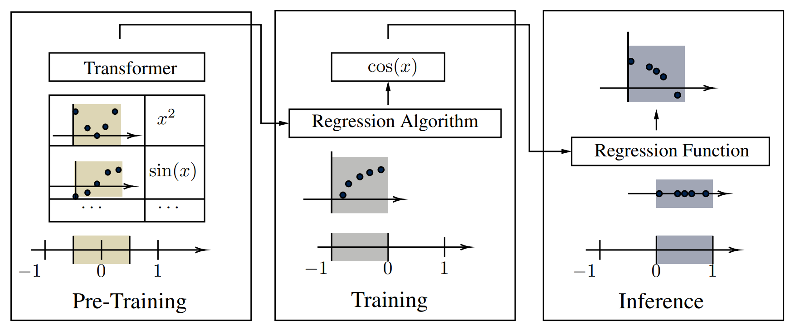

# Analyzing Generalization in Pre-Trained Symbolic Regression



Official implementation for the paper:

> **Analyzing Generalization in Pre-Trained Symbolic Regression**
> Voigt, H., Kahlmeyer, P., Lawonn, K., Habeck, M., & Giesen, J. (2025)
> arXiv:2509.19849
> [https://arxiv.org/abs/2509.19849](https://arxiv.org/abs/2509.19849)

---

## Overview

This repository contains the code and experimental setup used to analyze
generalization behavior in pre-trained symbolic regression models.

We evaluate multiple transformer-based symbolic regressors under controlled distribution shifts and
benchmark their extrapolation, interpolation, and robustness properties.

### Main Contributions

* Implementation of systematic evaluation protocols to test generalization in pre-trained symbolic regression
* Unified benchmarking pipeline for multiple regressors
* Scripts to reproduce all results from the paper
* Environment specifications for reproducibility

---

## Repository Structure

```
.
├── environments/        # Environment files for each regressor
├── regressors/          # Implementations / wrappers of evaluated models
├── datasets/            # Dataset descriptions and loading
├── experiments/         # Experiment scripts
├── src/                 # Source code for analysis utilities
├── test/                # Test scripts for regressors
└── README.md
```

---

## Setup

### 1. Clone the repository

```bash
git clone https://github.com/hennsn/analyzing_generalization_in_pretrained_sr.git
cd analyzing_generalization_in_pretrained_sr
```

### 2. Create the environment

Environments for each transformer-based regressor are stored in:

```
/environments
```

Example using conda:

```bash
conda env create --name my_env environments/<environment-name>.txt
conda activate <environment-name>
```

Or using pip:

```bash
pip install -r environments/<environment-name>.txt
```

---

## Regressors

This repository evaluates the following transformer-based symbolic regression approaches:

| Regressor   | Repository       | Paper          |
| ----------- | ----------------- | -------------------- |
| `E2E` | https://github.com/facebookresearch/symbolicregression | https://arxiv.org/abs/2204.10532 |
| `NeSymRes` | https://github.com/SymposiumOrganization/NeuralSymbolicRegressionThatScales | https://arxiv.org/pdf/2106.06427 |
| `TF4SR` | https://github.com/omron-sinicx/transformer4sr | https://arxiv.org/abs/2312.04070 |
| `TPSR` | https://github.com/deep-symbolic-mathematics/TPSR | https://arxiv.org/abs/2303.06833 |
| `SymFormer` | https://github.com/vastlik/symformer/ | https://arxiv.org/abs/2205.15764 |

Each regressor is isolated in its own environment to ensure reproducibility.

Use the environment setups provided in the repository of each regressor linked above.

**Baselines**: Besides the pre-trained methods above, we compared against the following baseline methods:

- Linear Regression
- Polynomial Regression
- Exhaustive Search
- GPLearn
- Operon
- DSR
- PySR

All regressors implement the standard sklearn regressor interface. Each regressor can be found in the `regressors` folder.

---

## Running Experiments

To reproduce experiments from the paper:

```bash
python experiments/run_<experiment-name>.py 
```

Example:

```bash
python experiments/run_robustness_experiments.py
```


---

## Evaluation Protocol

We evaluate models under:

* Interpolation in training domain
* Interpolation within training domain
* Extrapolation beyond training domain
* Robustness to shifts in input, scaling in input, noise on output and shifts in sampling distribution

### Metrics

* Recovery 
* Tree Edit Distance (TED)
* Jaccard Index (JI)
* R²
* Expression complexity

---

## Citation

If you use this repository in your research, please cite:

```bibtex
@article{voigt2025analyzing,
  title={Analyzing Generalization in Pre-Trained Symbolic Regression},
  author={Voigt, Henrik and Kahlmeyer, Paul and Lawonn, Kai and Habeck, Michael and Giesen, Joachim},
  journal={arXiv preprint arXiv:2509.19849},
  year={2025},
  doi={10.48550/arXiv.2509.19849},
  url={https://arxiv.org/abs/2509.19849}
}
```

---
